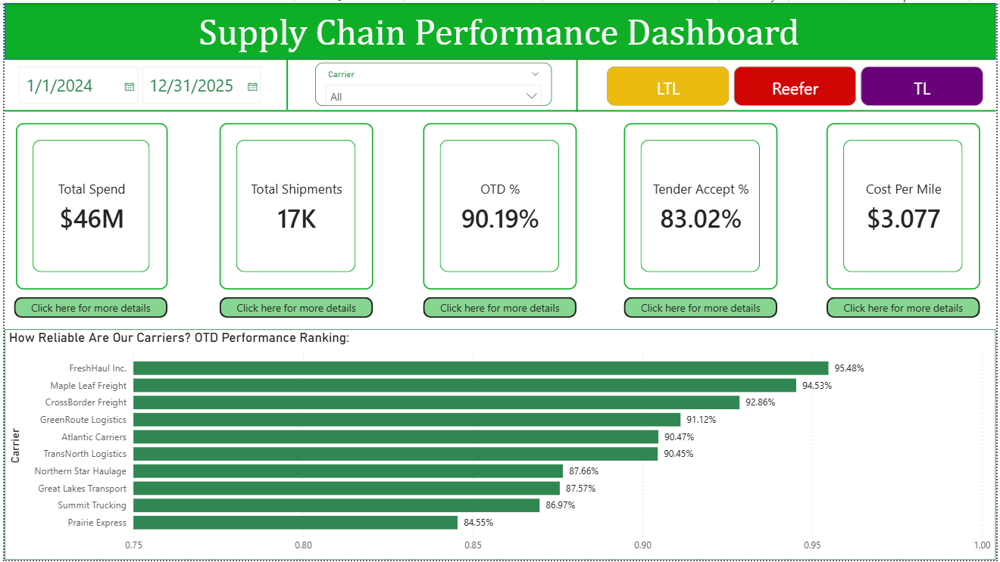

# Supply Chain Performance Dashboard

## Business Problem
How can a produce distribution company monitor and optimize its end-to-end supply chain — from freight spend and carrier reliability to order fulfillment and inventory health?

## Tools Used
- **SQL Server** — Data storage, querying, KPI extraction
- **Power BI** — Interactive dashboard with DAX measures
- **Excel** — Data preparation and validation
- **Python** — Synthetic dataset generation

## Dataset
| Table | Rows | Description |
|-------|------|-------------|
| Shipments | 17,124 | Freight shipment records across 10 carriers and 15 lanes |
| Orders | 6,899 | Customer orders with fulfillment status |
| Inventory | 630 | Weekly stock snapshots with spoilage tracking |
| Carriers | 10 | Carrier contract targets (OTD, acceptance rate) |
| Products | 6 | Produce items with cost, shelf life, reorder points |
| Warehouses | 3 | Distribution centers in Ontario |

## Dashboard Pages

### Page 1: Supply Chain Overview
- 5 KPI cards: Total Spend ($46M), Total Shipments (17K), OTD % (90.19%), Tender Accept % (83.02%), Cost Per Mile ($3.08)
- Interactive slicers: Date range, Carrier, Shipment Mode (TL/LTL/Reefer)
- Carrier OTD performance ranking (bar chart)

### Page 2: Freight, Fulfillment & Inventory Analysis
- Monthly freight spend trend (line chart)
- Customer fulfillment rate ranking (bar chart)
- Inventory health breakdown — Overstocked vs Adequate vs Below Reorder (donut chart)
- Product spoilage analysis (bar chart)

## Key Findings
1. **Prairie Express has the worst OTD at 84.55%** — 10% below the top performer FreshHaul Inc. (95.48%). Recommend shifting volume or renegotiating contract.
2. **5 out of 10 carriers are below their contractual OTD targets** — Summit Trucking has the largest gap at -1.03%.
3. **Only 11% of inventory snapshots show adequate stock levels** — 77% overstocked (increasing spoilage risk), 12% below reorder (fulfillment risk).
4. **Cucumbers have the highest spoilage** — likely due to shorter shelf life. Consider smaller, more frequent replenishment.
5. **FreshMart Distribution has the lowest fulfillment rate at 77.44%** — investigate whether this is a supply issue or demand forecasting gap.
6. **Freight spend shows seasonal peaks** — summer months have higher costs aligned with produce growing season.

## SQL Concepts Demonstrated
- Aggregate functions (SUM, COUNT, AVG, ROUND)
- GROUP BY with HAVING
- JOINs (Shipments to Carriers for target comparison)
- CASE WHEN for conditional calculations
- UNION / UNION ALL
- CAST for data type conversion
- FORMAT for date extraction

## DAX Measures Created
- `OTD %` — On-time delivery percentage using CALCULATE and DIVIDE
- `Tender Accept %` — Tender acceptance rate
- `Total Freight Spend` — Sum of all freight costs
- `Avg Cost Per Mile` — Average CPM across all shipments
- `Total Shipments` — Count of all shipment records
- `Fulfillment Rate` — Percentage of orders fully fulfilled

## How to Reproduce
1. Import CSV files into SQL Server (or any SQL database)
2. Run `supply_chain_queries.sql` to explore the data
3. Open `Supply_Chain_Dashboard.pbix` in Power BI Desktop
4. Connect to your SQL Server instance or use the CSV files directly

## Screenshots

